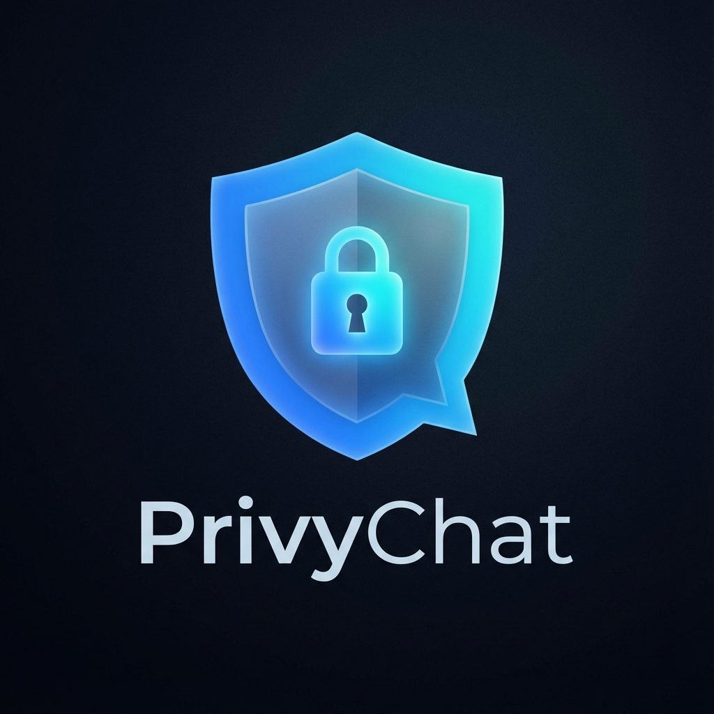

# 🛡️ PrivyChat - The Zero-Trace Spy Messenger



> **"Privacy is not a crime. It is a fundamental human right."**

**PrivyChat** is an open-source, ultra-secure, and ephemeral messaging platform designed for journalists, activists, whistleblowers, and privacy enthusiasts. It is engineered with a **"Zero-Trust"** philosophy: we assume the server is compromised, the network is tapped, and the device might be seized.

To combat this, PrivyChat operates entirely in **RAM (Random Access Memory)**, uses **Military-Grade End-to-End Encryption**, and includes distinct **"Spy Features"** like a decoy calculator mode and browser panic button.

---

## 📑 Table of Contents

1.  [Philosophy & Core Concepts](#-philosophy--core-concepts)
2.  [Features Overview](#-features-overview)
3.  [Technical Architecture](#-technical-architecture)
4.  [Security Protocol (Cryptography)](#-security-protocol)
5.  [Codebase Deep Dive](#-codebase-deep-dive)
    *   [Frontend Architecture](#frontend-appjs--indexhtml)
    *   [Backend Logic](#backend-serverjs)
6.  [Installation & Setup](#-installation--setup)
7.  [Deployment Guide](#-deployment-guide)
8.  [Disclaimer & License](#-disclaimer--license)

---

## 🧠 Philosophy & Core Concepts

### **1. RAM-Only Architecture**
Traditional chat apps store messages in databases (MongoDB, SQL, Redis). This leaves a forensic trail.
*   **PrivyChat approach:** Data exists **only** in the volatile memory of the Node.js process.
*   **Consequence:** If the server is restarted, crashed, or seized, **100% of the data is instantly and irrevocably lost**. There is no "Restore Backup" button.

### **2. Zero-Knowledge Server**
The server routes messages between users but **cannot read them**.
*   All encryption happens in the **Browser** (Client-Side) using the Web Crypto API.
*   The server only ever sees encrypted blobs (cipher text).

### **3. Plausible Deniability**
Security is useless if you are forced to give up your password.
*   **Decoy Vault:** A fake login system that redirects to a weather app, allowing you to prove you were just "checking the forecast".
*   **Stealth Mode:** A calculator overlay that hides the chat interface instantly.

---

## 🌟 Features Overview

### **🕵️‍♂️ Stealth Suite**
*   **Google Theme UI**: A landing page disguised as a search engine. Passersby will think you are just browsing Google.
*   **Ghost Mode**: Messages are **blurred by default**. They only reveal when you hover your mouse over them, preventing "shoulder surfing" in public transport or cafes.
*   **Stealth Calculator**:
    *   **Trigger**: Click the Mask Icon `🎭`.
    *   **Effect**: The app transforms into a functional scientific calculator.
    *   **Unlock**: Enter `1337` + `=` to retrieve your chat.
*   **Panic Button**:
    *   **Trigger**: Click the Red Siren `🚨`.
    *   **Effect**: Instantly disconnects socket, clears `localStorage`, `sessionStorage`, and redirects to `google.com`.

### **💬 Messaging**
*   **1v1 Secure Links**: "I'm Feeling Lucky" button generates a unique UUID room. The encryption key is embedded in the URL hash (`#key`) so the server never receives it.
*   **Private Rooms**: Password-protected named rooms (e.g., "TeamAlpha").
*   **Voice Notes**: Record encrypted audio clips (`Opus/WebM`).
*   **File Sharing**: Send images and documents. Files are encrypted chunk-by-chunk before upload.
*   **Self-Destruct**: Set messages to auto-delete (5s, 10s, 30s) after being viewed.

### **Secure Calling (v5.1)**
-   **Video Calls (WebRTC)**: High-definition, P2P video chat. No server recording.
-   **Voice Calls**: Audio-only mode for privacy or low bandwidth.
-   **Encryption**: DTLS-SRTP (Standard WebRTC encryption).

### **App Installation (v4.0)**
-   **PWA Support**: Install PrivyChat as a native app on Android/iOS/Desktop.
-   **Offline Shell**: Loads instantly even on spotty networks.

### **🎨 Immersion & UX (v3.3)**
*   **Voice Masks**: Record voice notes with disguises (Robot, Chipmunk, Monster) to protect your identity.
*   **Matrix Hacker Theme**: A full visual overhaul with terminal green aesthetics, triggered via the 👨‍💻 button.
*   **Sound Effects**: Satisfying audio feedback for sending, receiving, and joining rooms (using WebAudio synth, no external assets).
*   **Interactive User List**: Click the "Online Count" to see exactly who is in the room.
*   **Swipe-to-Reply**: Drag any message to the right to reply to it instantly.

---

## 🏗️ Technical Architecture

PrivyChat is a **Real-Time Single Page Application (SPA)** built with Vanilla JavaScript and Node.js.

### **System Design**
```mermaid
graph TD
    UserA[User A (Browser)] <-->|Encrypted WSS| Server[Node.js Server (RAM Only)];
    UserB[User B (Browser)] <-->|Encrypted WSS| Server;
    
    UserA -- Key Exchange (RSA-OAEP) --> UserB;
    UserA -- AES-GCM Encrypted Data --> Server --> UserB;
```

*   **Runtime**: Node.js (v14+)
*   **Framework**: Express.js (HTTP Server)
*   **Protocol**: Socket.io v4 (WebSockets with Polling fallback)
*   **Frontend**: HTML5, CSS3 (Glassmorphism), Vanilla JS (ECMAScript 2020)
*   **Cryptography**: `window.crypto.subtle` (Native Web Crypto API)

---

## 🔐 Security Protocol

We use a hybrid encryption scheme to ensure speed and security.

### **1. Key Generation (PBKDF2)**
For **Private Rooms**, keys are derived from the password.
*   **Algorithm**: `PBKDF2` (Password-Based Key Derivation Function 2)
*   **Hash**: `SHA-256`
*   **Iterations**: 100,000 (To prevent brute-force attacks)
*   **Salt**: Room Name
*   **Output**: A 256-bit AES-GCM Encryption Key.

### **2. Message Encryption (AES-GCM)**
All messages (Text, Images, Audio) are encrypted using **AES-GCM** (Galois/Counter Mode).
*   **Why AES-GCM?**: It provides both **Confidentiality** (they can't read it) and **Integrity** (they can't temper with it).
*   **IV (Initialization Vector)**: A unique 12-byte random IV is generated for *every single message*. This ensures that sending "Hello" twice results in two completely different encrypted strings.

### **3. Transport Layer**
All data is transmitted over **HTTPS / WSS** (Secure WebSockets), providing a second layer of encryption (TLS/SSL) against network sniffers.

---

## 💻 Codebase Deep Dive

### **Directory Structure**
```bash
PrivyChat/
├── public/              # Frontend Assets
│   ├── index.html       # Single Entry Point (Lobby + Chat)
│   ├── style.css        # CSS3 (Glassmorphism, Animations)
│   ├── app.js           # Core Logic (Socket, UI, Events)
│   ├── crypto-utils.js  # Cryptography Helper Library
│   ├── manual.html      # User Manual
│   └── logo.png         # Project Logo
├── server.js            # Node.js Backend Entry Point
├── package.json         # Dependencies & Scripts
└── README.md            # Documentation
```

### **Frontend: `app.js` & `crypto-utils.js`**
The frontend is the "Brain" of the security.
*   **`CryptoUtils.deriveKey(password, salt)`**:
    Uses `window.crypto.subtle.importKey` and `deriveKey` to turn a text password into a crypto-object.
*   **`sendMessage()`**:
    1.  Captures input text.
    2.  Calls `CryptoUtils.encrypt(text, key)`.
    3.  Emits `socket.emit('send_message', { data, iv })`.
*   **`googleJoin()`**:
    Determines if the user input is a Room Code or a Spy Keyword (`weather`, `guest`).
    ```javascript
    if (val === 'weather') {
        window.location.replace("https://weather-app-url...");
    }
    ```

### **Backend: `server.js`**
The backend is intentionally "dumb".
*   **`users = {}`**: Maps SocketIDs to Usernames/Rooms.
*   **`socket.on('join_room')`**:
    *   Validates room password (if set).
    *   Adds socket to Socket.io room channel.
*   **`socket.on('send_message')`**:
    *   Receives data.
    *   Broadcasts to `room`.
    *   **Does NOT store data.** The message object is garbage collected immediately after transmission.

---

## 🚀 Installation & Setup

### **Prerequisites**
*   **Node.js**: Download and install from [nodejs.org](https://nodejs.org/).

### **Local Deployment**
1.  **Clone the Repo**:
    ```bash
    git clone https://github.com/rajpratham1/PrivyChat.git
    cd PrivyChat
    ```

2.  **Install Dependencies**:
    ```bash
    npm install express socket.io
    ```

3.  **Run Development Server**:
    ```bash
    npm run dev
    # or
    node server.js
    ```

4.  **Access App**:
    Open Browser at `http://localhost:3000`.

---

## ☁️ Deployment Guide

### **Deploy to Render.com (Recommended)**
Since PrivyChat uses WebSockets, specific configuration is needed.
1.  Push code to **GitHub**.
2.  Create a **New Web Service** on Render.
3.  Connect your Repo.
4.  **Build Command**: `npm install`
5.  **Start Command**: `node server.js`
6.  **Environment Variables**: None needed for basic usage.

### **Important Note on Vercel/Netlify**
**Do NOT deploy to Vercel or Netlify.**
These are "Serverless" platforms. They cannot maintain the persistent WebSocket connections required for Real-Time chat. You **must** use a NodeJS hosting provider like Render, Railway, Fly.io, or DigitalOcean.

---

## ⚠️ Disclaimer & License

### **Educational Purpose**
This software is provided for **educational and research purposes**. While it utilizes industry-standard encryption, it has not undergone a formal third-party security audit. The developers are not liable for any compromises arising from the use of this software.

### **MIT License**
Copyright (c) 2026 PrivyChat

Permission is hereby granted, free of charge, to any person obtaining a copy of this software and associated documentation files (the "Software"), to deal in the Software without restriction, including without limitation the rights to use, copy, modify, merge, publish, distribute, sublicense, and/or sell copies of the Software, and to permit persons to whom the Software is furnished to do so, subject to the following conditions:

The above copyright notice and this permission notice shall be included in all copies or substantial portions of the Software.

THE SOFTWARE IS PROVIDED "AS IS", WITHOUT WARRANTY OF ANY KIND.

---

**Built with ❤️ and Paranoia.**
